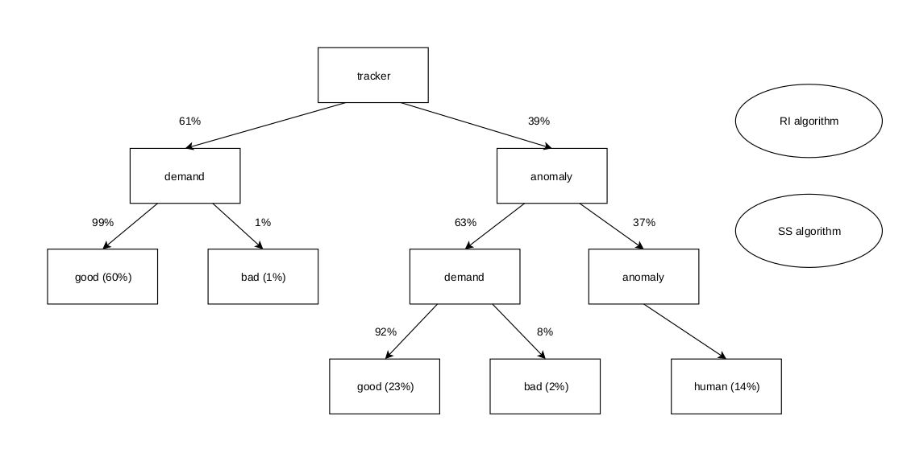
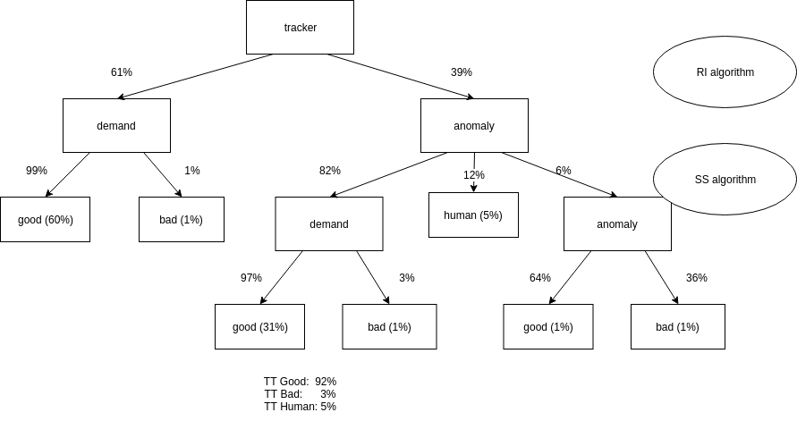

# ORAW3 missing features pipeline explained

We looked forward to improving our results by integrating human agents in our process when required.

## Previons observations

The project [oraw2](https://git.rnd.alterway.fr/overboard/openreq/oraw2_issue-weight) showcase two algorithms capable of predicting if a ticket reports a demand or an anomaly.

- scikit-sentistrength 15k

| tracker      | precision | recall | support |
|--------------|-----------|--------|---------|
| Demand       | 0.97      | 0.90   | 2760    |
| Anomaly      | 0.42      | 0.72   | 274     |
| Weighted avg | 0.92      | 0.88   | 3034    |

- ri-analytics 15k

| tracker      | precision | recall | support |
|--------------|-----------|--------|---------|
| Demand       | 0.99      | 0.66   | 2760    |
| Anomaly      | 0.21      | 0.92   | 274     |
| Weighted avg | 0.92      | 0.68   | 3034    |

Their prediction summary features a great precision when it comes to the demands but weaker results concerning the anomaly class.

We also noticed via [this](output.html) statistical analysis that the result returned are significantly different and that in consequence, we may be able to combine the result to improve our understanding of the tickets.

## Combination of the previous results

We explored the set of decision tree and researched the best place to include the human operator.
We identified the most promising tree, which minimize the error ratio and then the human influence on the prediction:

This solution reduces the error ratio to 3% while requiring human assistance only 14% of the time.

However the previous solution does not include the Anomaly class anymore. So we've modified the SS algorithm to be a ternary classifier by extracting the predicted probabilities and returning the class Anomaly when the probability is over 0.8 and Human between 0.5 and 0.8.

The threshold 0.8 allows us to have 2/3 of good classifications for the class anomaly while keeping at least 1% of issues predicted to be an anomaly.